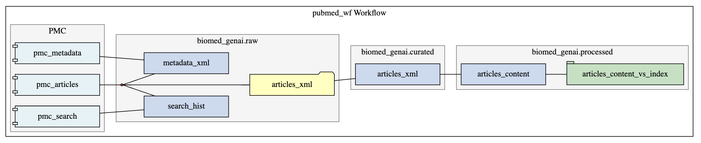
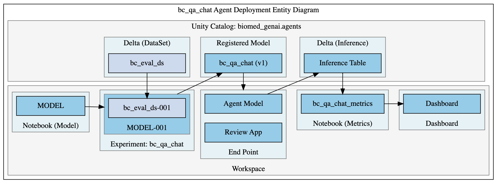

# biomed_genai

The **biomed_genai** project is a solution accelerator that will provide convention on how to contruct a Enterprise Grade Generative AI Application. The folder structure of the git project as well as conventions around application configurations management are intended not to show off Databricks components, but how to structure applications to facilitate Enterprise CI/CD deployment patterns and LLMOps Governanace.

### Code Categories

At the first level there are two folders in root that categorize code:
 * databricks - This folder contains the notebooks and configurations to build application component within a databricks environment.

 * python - This folder will contain modularize, reusable code. It is organized in such a way that if required, it can be packaged and deployed as a python wheel file. Organizing reusable, modularized code in this way will simplify unit testing, system integration testing, and package release management. 

### Application Component Categories

Within Generative AI projects, we'll use three Application Component Categories within both code categories:

 * **workflow** - This is where we consolidate the genai workflows within the project. These will include both workflows that are a data curation that lead to a retriever that can be a dependency in an agent or model fine-tuning or a workflow to apply an agent. Workflows withing this directory can typically be developed and maintained by a data engineer with collaboration from a GenAI Data Scientist during the first iteration.
 * **model** - This is where we consolidate the models used within the project. In this case we are refering to models types of embedding, chat, and completion. We are explicitly excluding agent models which will actually use models as dependencies.
 * **agent** - This is where we maintain the agent that

**NOTE**: This project doesn't include the application front end development since this can be done by many different frameworks and is deployed outside of Databricks. However, for consolidation of project code, it would be viable to maintain the application web frontend inside this project structure. It is also viable to maintain in a separate version controlled project. Follow existing conventions where applicable.

# Project Applications

 * pubmed_wf - This includes the workflow tasks to populate a vector store with PubMed articles content. It is initially configured for only articles specific to Breast Cancer, but is intended to be arguemented for any additional articles if interest. 
   * 

 * bc_qa_char - This agent is a bot that will support researchers in the area of Breast Cancer research.
   * 

---

# Complete End-to-End Execution Guide

This guide walks you through **every step required to run, configure, and deploy** the BioMed-GenAI solution as delivered in your repository. It covers environment prerequisites, configuration, code execution order, pipeline orchestration, and deployment of both retriever and agent workflows. **No steps are skipped.**

---

## 1. Environment Prerequisites

- **Cloud:** Databricks (Workspace with access to Unity Catalog, Delta Lake, MLflow, and Databricks Agents)
- **Compute:** One or more clusters with sufficient RAM, CPU, and access to external sources (S3, etc.)
- **Secrets:** Databricks secrets for any API keys, DB credentials, etc.
- **Permissions:** You must have privileges to create tables/volumes/experiments in the target catalog/schema.
- **Python Libraries:** All required libraries are specified in setup notebooks & model requirements (see below).

---

## 2. Repository Structure Overview

- `databricks/model/retriever/pubmed_wf/`: Retriever pipeline (data ingest, curation, chunking, vector index)
- `databricks/agent/`: Agent pipeline (chatbot, eval, model registration, deployment)
- `databricks/_config/config_biomed_genai.yaml`: Central configuration file (catalogs, paths, agent settings, etc.)

---

## 3. Central Configuration

### 3.1. **Edit `config_biomed_genai.yaml`**

- Set all catalog names, schema names, S3/volume paths, and agent/model parameters as appropriate for your workspace.
- Ensure all UC, workspace, and path references are correct for your environment.

---

## 4. Retriever Pipeline: End-to-End Execution

### 4.1. **Setup All Dependencies and Paths**

- Open `databricks/model/retriever/pubmed_wf/_setup/setup_pubmed_wf.py`
    - Run all cells. This will:
        - Install required Python packages if not already on your cluster
        - Set up all Python paths and load the central config
        - Instantiate the main config class as `pubmed_wf`
    - If running interactively, set visualization widgets as needed.

### 4.2. **Configure and Inspect Workflow Entities**

- Optionally run `00_pubmed_wf_config.py` to inspect the workflow config and entity mapping.

### 4.3. **Ingest and Synchronize Metadata**

- Run `01_Metadata_Sync.py`
    - This notebook streams PMC metadata from S3 into your Delta table (`raw_metadata_xml`).
    - It uses autoloader and upserts records as new/updated.
    - Confirm successful termination and inspect the table if desired.

### 4.4. **Ingest Raw Articles**

- Run `02_Articles_Ingest.py`
    - This will use search criteria (keywords, dates) to find and download raw article XMLs from PMC.
    - Downloads and updates metadata (status, path) accordingly.
    - Inspect the status table or logs for any errors.

### 4.5. **Curate Articles**

- Run `03_Curate_Articles.py`
    - Parses downloaded XMLs, extracts content and metadata, and writes to the curated articles Delta table.
    - Ensures no duplicate curation for downloaded articles.

### 4.6. **Chunk Articles for Vector Search**

- Run `04_Chunk_Articles_Content.py`
    - Uses the `unstructured` library to chunk curated articles into passages for semantic search.
    - Writes chunked content and metadata to the processed articles Delta table.

### 4.7. **Create/Sync Vector Search Index**

- Run `05_Sync_VectorSearch_Index.py`
    - Syncs the chunked article content Delta table to a Databricks Vector Search index.
    - Use the optional inspection cells to verify index status and sample queries.

### 4.8. **Orchestrate as a Job (Recommended for Production)**

- Run `06_Create_Sync_Job.py`
    - Creates or updates a Databricks Job that orchestrates the previous notebooks as workflow tasks, with dependencies and a schedule.
    - Inspect the created job in the Databricks Jobs UI and trigger it as needed.

---

## 5. Agent Pipeline: End-to-End Execution

### 5.1. **Setup Agent Dependencies and Paths**

- Open `databricks/agent/bc_qa_chat/_setup/setup_bc_qa_chat.py`
    - Run all cells to:
        - Install required Python packages (see install section in the notebook)
        - Set up paths and load agent config from YAML
        - Instantiate the agent model config class as `bc_qa_chat`

### 5.2. **Configure and Inspect Agent Config**

- Optionally run `00_CONFIG_bc_qa_chat_config.py` to inspect and validate agent configurations.

### 5.3. **Create/Curate Evaluation Dataset**

- Run `01_DATASET_bc_eval_ds.py`
    - Create or update the evaluation dataset for model evaluation.
    - Write the set to Delta table if not already present.

### 5.4. **Develop and Evaluate Models**

- Run the following notebooks in sequence for each candidate model:
    - `02_AGENT_MODELS.py`
        - Checks candidate model readiness.
    - `agent_model/02_01_Candidate_Runs.py`
        - Runs and logs candidate model experiments.
    - `agent_model/02_02_Score_Register.py`
        - Scores, registers, and (optionally) deploys the best candidate model.
    - `agent_model/02_03_Review_App_Feedback.py`
        - Reviews feedback and logs results.
    - `agent_model/02_04_Designate_Champion.py`
        - Designates the champion (production) model for release.

### 5.5. **Model Deployment and Release**

- Run `05_RELEASE_biomed_genai.py`
    - Finalizes the agent release: writes production versions, optionally packages code, and triggers a final commit/PR.
    - Follow any prompts for validation or manual steps.

### 5.6. **Optional: Run Component_Example.py**

- Use this for demonstration, debugging, or onboarding new team members to the component architecture.

---

## 6. Automation & Job Orchestration

- For retriever pipeline, use the Databricks Job created in `06_Create_Sync_Job.py`.
- For agent/model pipeline, automate as needed using Databricks Jobs, MLflow projects, or CI/CD workflows.

---

## 7. Monitoring, Evaluation, and Feedback

- Use the dashboards and agent evaluation tools (see `04_DASHBOARDS.py` in agent) to monitor pipeline and model performance.
- Review logs, feedback, and evaluation metrics regularly.
- Use [Databricks documentation](https://docs.databricks.com/en/generative-ai/agent-evaluation/index.html) for best practices on monitoring, evaluation, and retraining.

---

## 8. Upgrades, Maintenance, and Release Management

- All configuration changes should be made in `config_biomed_genai.yaml` and then re-run the respective setup notebooks.
- Use release notebooks and branching guidelines as described in workflow markdown headers.
- For code or pipeline changes, open PRs as per the repository’s guidelines and perform a full regression test before promoting to production.

---

## 9. Troubleshooting

- **Dependency errors:** Re-run setup notebooks on a clean cluster and ensure cluster libraries are up to date.
- **Table/index not found:** Double-check config and rerun setup and ingestion notebooks.
- **Job failures:** Inspect logs for missing paths, permission errors, or data format issues.
- **Agent/model not updating:** Ensure correct experiment and model names in config, and that MLflow endpoints are accessible.

---

## 10. References

- [Databricks GenAI Documentation](https://docs.databricks.com/en/generative-ai/index.html)
- [MLflow Model Management](https://mlflow.org/docs/latest/index.html)
- [Databricks Vector Search](https://docs.databricks.com/en/generative-ai/vector-search/index.html)
- [Project config YAML](../_config/config_biomed_genai.yaml)
- All notebooks and scripts contain detailed headers and inline documentation.

